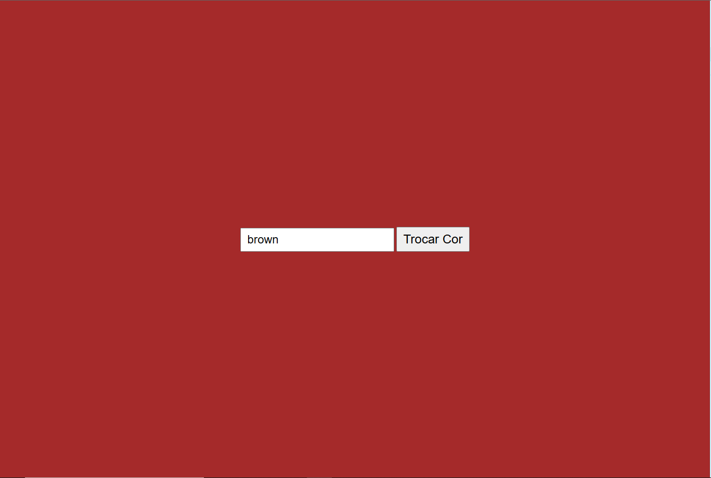

# Projeto troca de cores

---

# Landing Page - Cores

O objetivo desse projeto é colocar em pratica os conhecimentos adiquiridos sobre as linguagens, HTML, CSS, e principalmente JS, durante o curso Técnico de desenvolvimento do [SENAI Jandira](https://sp.senai.br/unidade/jandira/)

---

## Tecnologias utilizadas

- HTML
- CSS
- Markdown
- Git
- JS

---

## Autor 

- [Kaike Bueno](https://www.linkedin.com/in/kaike-bueno-3b10a82b1/)